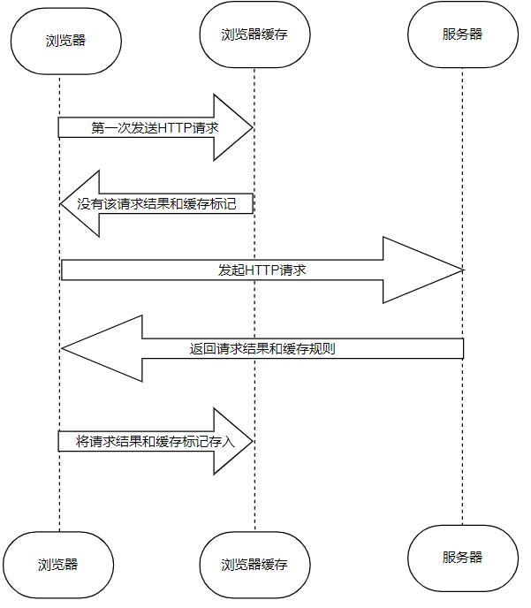
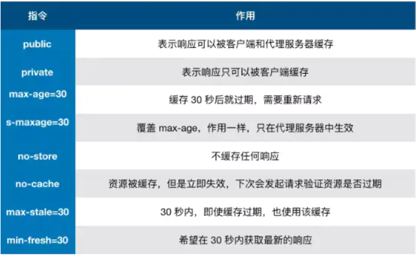
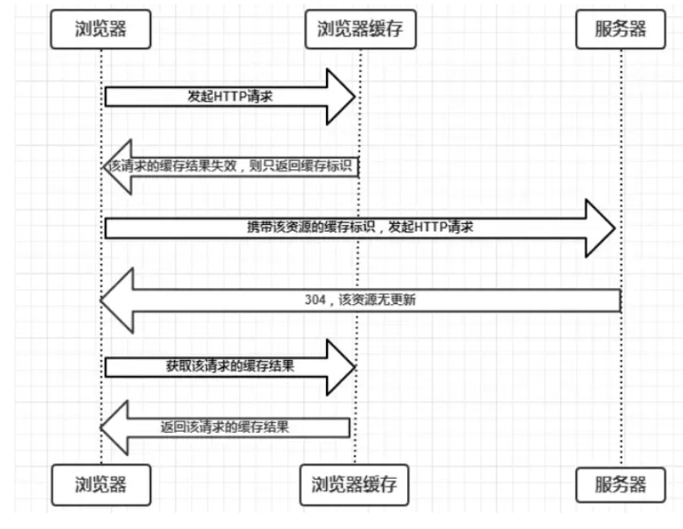
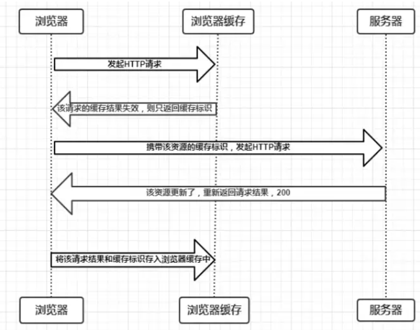
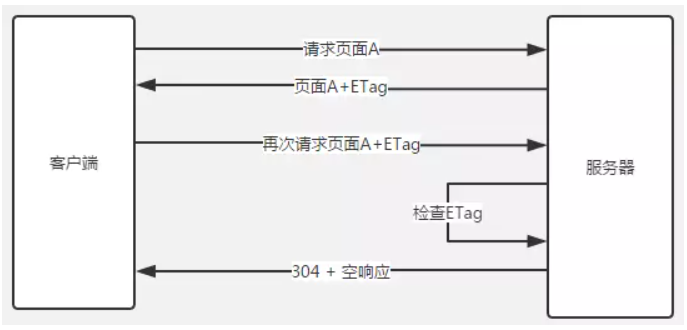
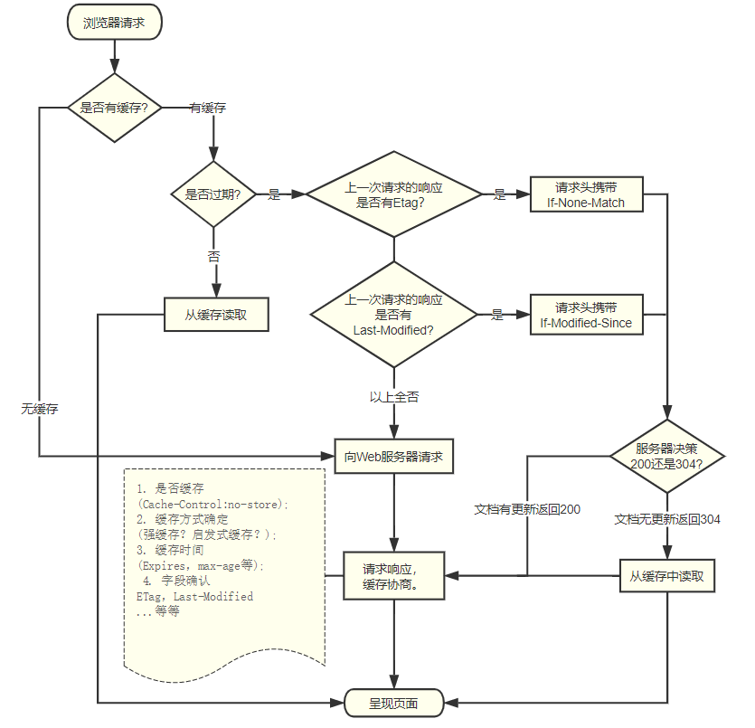
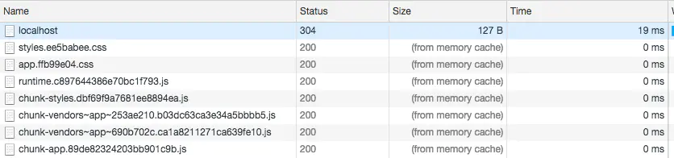

# 缓存机制

## 前言

浏览器缓存是一种简单高效的优化网页的方法。浏览器缓存策略能够缓存文件，
减少网页的网络请求，提高性能，减少带宽消耗。

基本的网络请求就是三个步骤：网络请求，后端处理，浏览器响应。
浏览器缓存能够帮助我们在第一步和第三步中进行性能优化。
比如说：当发送请求时，已经有缓存了，或者说后端的数据与前面一致那么就没必要返回数据，这样就能减少数据响应。

接下来就来分析下浏览器缓存：缓存位置、缓存机制、用户行为对浏览器的影响以及前端缓存最佳实践。


## 缓存位置

浏览器会将缓存放在四个位置，并且有优先级。当浏览器四个位置中都没有缓存时，会发生网络请求。

位置顺序如下：

1. Service Worker

2. Memory Cache

3. Disk Cache

4. Push Cache

### Service Worker

Service Woker 是运行在浏览器背后的独立线程，一般可以用来实现缓存。
使用 Service Woker 必须采用 Https，因为 Service Woker 中涉及到请求拦截，所以必须用https来保障安全。
Service Woker的缓存与其他浏览器内置的缓存不同，它可以自由配置缓存哪些文件、如何匹配缓存、如何获取缓存、并且缓存是持续性的。

Service实现缓存一般分为三个步骤：

1. 注册Service Worker

2. 监听install事件

3. 缓存需要文件
```js
    //使用 ServiceWorkerContainer.register()方法首次注册service worker。
    if (navigator.serviceWorker) {
        navigator.serviceWorker.register('./sw.js', {scope: './'})
            .then(function (registration) {
                console.log(registration);
            })
            .catch(function (e) {
                console.error(e);
            });
    } else {
        console.log('该浏览器不支持Service Worker');
    }
```

再来看看具体作为service worker的文件sw.js，例子如下：

```js
const CACHE_VERSION = 'v1'; // 缓存文件的版本
const CACHE_FILES = [ // 需要缓存的文件
	'./test.js',
	'./app.js',
	'https://code.jquery.com/jquery-3.0.0.min.js'
];

self.addEventListener('install', function (event) { // 监听worker的install事件
    event.waitUntil( // 延迟install事件直到缓存初始化完成
        caches.open(CACHE_VERSION)
		.then(function (cache) {
			console.log('缓存打开');
			return cache.addAll(CACHE_FILES);
		})
    );
});

self.addEventListener('activate', function(event) {// 监听worker的activate事件
    event.waitUntil(// 延迟activate事件直到
        caches.keys().then(function(keys) {
            return Promise.all(keys.map(function(key, i){
                if(key !== CACHE_VERSION){
                    return caches.delete(keys[i]); // 清除旧版本缓存
                }
            }))
        })
    )
});

self.addEventListener('fetch', function(event) { // 截取页面的资源请求
    event.respondWith(
        caches.match(event.request).then(function(res) { // 判断缓存是否命中
            if (res) { // 返回缓存中的资源
                return res;
            }
            _request(event); // 执行请求备份操作
        })
    )
});

function _request(event) {
    var url = event.request.clone();
    return fetch(url).then(function(res) {// 使用fetch请求线上资源
        // 错误判断
        if (!res || res.status !== 200 || res.type !== 'basic') {
            return res;
        }

        var response = res.clone(); // 创建了一个响应对象的克隆,储藏在一个单独的变量中

        caches.open(CACHE_VERSION).then(function(cache) {// 缓存从线上获取的资源
            cache.put(event.request, response);
        });
        return res;
    })
}
```
在下次用户访问就可以采用拦截的方式查询是否存在缓存，如果存在缓存则直接使用，否则发起请求。

### Memory Cache
Memory Cache是内存中的缓存, 读取速度快，但缓存持续时间短，随着进程的释放而释放。
主要包含当前页面中抓取到的资源，例如页面上已经加载的图片、样式、脚本等。


内存缓存的实际场景：当访问一个页面，再刷新时，会发现很多数据都来自内存缓存。

如下图，看Sise: from memory cache：


内存缓存的实际释放场景：将浏览器标签关闭掉，那么此时内存中的缓存也就释放了。

内存缓存中有一块重要的缓存资源是`prefetch`相关指令下载的资源（<link rel="prefetch">）。
它可以一边下载`css/js`资源一边请求网络请一个资源。

注意：内存缓存并不关心返回的HTTP响应头中的Cache-Control是什么值。
资源也并非仅仅对URL做匹配，还有可能对Context-Type,Cors等其他特征做校验。

### Disk Cache
Disk Cache 是存储硬盘中的缓存，读取速度较Memory cache慢点，但存储各自资源，并且支持时间长。

在浏览器所有的缓存中，Disk Cahce被使用的最多。它可以根据请求头字段来判断是否能够读取缓存，
判断哪些资源需要重新请求。即使在跨站点访问的时候，相同地址的资源一旦被存储在硬盘中，只要不过期
就不再请求数据了。

浏览器会把哪些文件缓存进内存，哪些存进硬盘：

1. 大文件大概率存在硬盘中，反之存在内存中

2. 使用率高的文件存在硬盘中，反之存在内存中。

### Push Cache

什么是 Push Cache?

Push Cache（推送缓存）是 HTTP/2 中的内容，当以上三种缓存都没有命中时，它才会被使用。它只在会话（Session）中存在，一旦会话结束就被释放，并且缓存时间也很短暂，在Chrome浏览器中只有5分钟左右，同时它也并非严格执行HTTP头中的缓存指令。

Push Cache 特征：

1. 所有的资源都能被推送，并且能够被缓存,但是 Edge 和 Safari 浏览器支持相对比较差

2. 可以推送 no-cache 和 no-store 的资源

3. 一旦连接被关闭，Push Cache 就被释放

4. 多个页面可以使用同一个HTTP/2的连接，也就可以使用同一个Push Cache。这主要还是依赖浏览器的实现而定，出于对性能的考虑，有的浏览器会对相同域名但不同的tab标签使用同一个HTTP连接。

5. Push Cache 中的缓存只能被使用一次

6. 浏览器可以拒绝接受已经存在的资源推送

7. 你可以给其他域名推送资源

8. 如果以上四种缓存都没有命中的话，那么只能发起请求来获取资源了。

通常浏览器缓存策略分为两种：强缓存和协商缓存，并且缓存策略都是通过设置 HTTP Header 来实现的。

## 缓存过程

**浏览器是怎么确定一个资源该不该缓存，如何缓存？**

浏览器第一次发送请求后将请求结果和缓存标记存入浏览器缓存中。

浏览器缓存处理时根据第一个请求返回的响应头来处理的。

具体缓存过程，如下图所示：


由上图，可知：

1. 浏览器每次发送请求，都会检查缓存中是否存在请求结果和缓存标识

2. 浏览器每次获取到的请求结果都会被存入缓存中

根据浏览器是否向服务器重新发送请求缓存过程，还可分为两个部分：**强缓存** 和 **协商缓存**

## 强缓存

强缓存不会向服务器发送请求，直接从缓存中读取资源。

实际场景：在chorme浏览器中打开控制台，点击NetWork选项中，然后F5刷新，可以看到请求返回Size: from memory cache 或者 from disk cache。
强缓存可以通过设置HTTP Header实现：Expires 和 Cache-Control。

### Expires

**缓存过期时间，用来指定资源过期时间，是服务器的具体时间点**
比如：Expires: max-age + 请求时间（需要配合Last-modified使用）。
Expires是web服务器响应头字段，在响应HTTP请求时告诉浏览器在过期时间前可以从缓存中获取资源，而无需再次请求。

**Expires 是 HTTP/1的产物，受限于本地时间，如果修改了本地时间，可能会造成缓存失效**

例子：`Expires: Wed, 22 Oct 2020 08:41:00 GMT` 表示资源会在 Wed, 22 Oct 2020 08:41:00 GMT 后过期，需要再次请求。

### Cache-Control

Cache-Control是HTTP/1.1中的规则，主要用于控制网页缓存。比如：`Cache-Control:max-age=300`表示在这个正确返回时间的五分钟内若再次发送请求则命中缓存。

Cache-Control 可以在请求头或者响应头中设置，并且可以组合使用多种指令：



public: **所有内容都被缓存** 具体来说响应可被任何一个节点缓存。例如：browset => proxy => proxy1 => Server，中间的proxy可以缓存。
比如下次再请求同一资源的时候，proxy1可以直接把自己缓存的东西给proxy不用再向Server请求。

private： **所有内容只有客户端可以缓存** Cache-Control的默认取值。具体来说，表示中间节点不允许缓存。

no-cache： 客户端缓存内容，是否需要缓存则需要经过协商缓存来决定。
表示不使用Cache-Control的缓存控制方式做前置方式，而是使用Etag或last-Modified字段来控制缓存。
需要注意的是:no-cache这个名字有一点误导。
设置了no-cache之后，并不是说浏览器就不再缓存数据，只是浏览器在使用缓存数据时，需要先确认一下数据是否还跟服务器保持一致。

no-store: 所有内容都不会被缓存，既不会使用强缓存也不会使用协商缓存。

max-age: max-age:xxx 表示缓存在xxx秒后失效。

s-maxage: 同 max-age 作用一样，只在代理服务器中生效。

max-state: 能容忍的最大时间。max-stale指令标示了客户端愿意接收一个已经过期了的响应。如果指定了max-stale的值，则最大容忍时间为对应的秒数。如果没有指定，那么说明浏览器愿意接收任何age的响应（age表示响应由源站生成或确认的时间与当前时间的差值）。

min-fresh：能够容忍的最小新鲜度。min-fresh标示了客户端不愿意接受新鲜度不多于当前的age加上min-fresh设定的时间之和的响应。

### Expires和Cache-Control两者对比
Expires是HTTP/1的产物，Cache-Control是http1.1的产物。
**两者同时存在的话，Cache-Control优先于Expires**。
在某些不支持HTTP1.1的环境下，Expires就会发挥用处。所以Expires其实是过时的产物，现阶段它的存在只是一种兼容性的写法。

强缓存判断是否缓存的依据来自于是否超出某个时间或者某个时间段，而不关心服务器端文件是否已经更新。
这可能会导致加载文件不是服务器端最新的内容，那我们如何获知服务器端内容是否已经发生了更新呢？
此时我们需要用到协商缓存策略。


## 协商缓存

**协商缓存是在强缓存失效后，浏览器携带缓存标识向服务器发起请求，有服务决定是否使用缓存的过程。**

协商缓存生效，返回304和Not Modified的过程如下图：



协商缓存失效，返回200和请求结果:



协商缓存通过两种HTTP Header 来设置：last-Modified 和 Etag

### Last-Modified和If-Modified-Since

浏览器在第一次请求资源的同时，在响应头中添加Last-Modified，值是服务器最后修改该资源的时间。
浏览器接收到响应后缓存文件的header。

```
Last-Modified: Fri, 22 Jul 2016 01:47:00 GMT
```

浏览器下次发起请求时，检测到有Last-Modified这个请求头字段，于是添加If-Modified-Since这个header，值是Last-Modified的值。
服务器再次接收到请求时，对比If-Modified-Since中的值与服务器最后修改资源的时间。
如果一致返回空的响应体和304，让浏览器在缓存中取。
如果If-Modified-Since的时间小于服务器中这个资源的最后修改时间，说明文件有更新，于是返回新的资源文件和200。

但是 Last-Modified 存在一些弊端：

1. 如果本地打开缓存文件，即使没有对文件进行修改，但还是会造成Last-Modified被修改，服务端不能命中缓存导致
发送相同的资源

2. 因为Last-Modified 是以秒计的。如果在不可感知的时间内修改资源，那么服务器会认为命中缓存，不会传回正确的资源。

既然根据文件修改时间来决定是否缓存尚有不足，能否可以直接根据文件内容是否修改来决定缓存策略？
所以在 HTTP / 1.1 出现了 ETag 和If-None-Match

### Etag 和 If-None-Match

Etag是服务器在响应请求时，返回当前资源文件的唯一标识，只要资源发生变化，Etag会重新生成。
浏览器在接收到服务器传来的Etag并保存，在下次发起请求是将Etag的值放在request header里的
If-None-Match里，服务器只需对比该If-None-Match和该资源上的Etag是否一致。如果一致，则返回
304通知浏览器直接从缓存中获取资源，否则返回200以及新资源（包括新的Etag）。



### 两者之间对比

从精度，Etag要优于Last-Modified；

从性能上，Etag要逊于Last-Modified，Last-Modified只需要记录时间，而Etag需要通过算法生成不同的hash值。

从优先级上，Etag会被服务器优先考虑。

## 缓存机制流程

强制缓存优先于协商缓存进行，若强制缓存(Expires和Cache-Control)生效则直接使用缓存。

若不生效则进行协商缓存(Last-Modified / If-Modified-Since和Etag / If-None-Match)。

协商缓存由服务器决定是否使用缓存，若协商缓存失效，那么代表该请求的缓存失效，返回200，重新返回资源和缓存标识，再存入浏览器缓存中；
生效则返回304，继续使用缓存。

具体流程图如下：



如果什么缓存策略都没设置，那么浏览器会怎么处理？

对于这种情况，浏览器会采用一个启发式的算法，通常会取响应头中的 Date 减去 Last-Modified 值的 10% 作为缓存时间。

## 用户行为对浏览器缓存的影响

所谓用户行为对浏览器缓存的影响，指的就是用户在浏览器如何操作时，会触发怎样的缓存策略。主要有 3 种：

1. 打开网页，地址栏输入地址： 查找 disk cache 中是否有匹配。如有则使用；如没有则发送网络请求。

2. 普通刷新 (F5)：因为 TAB 并没有关闭，因此 memory cache 是可用的，会被优先使用(如果匹配的话)。其次才是 disk cache。

3. 强制刷新 (Ctrl + F5)：浏览器不使用缓存，因此发送的请求头部均带有 Cache-control: no-cache(为了兼容，还带了 Pragma: no-cache),服务器直接返回 200 和最新内容。

## 前端最佳实践

缓存的意义就在于减少请求，给用户更好的体验的同时，也减轻服务器压力。
所以，最佳实践就应该尽可能命中强缓存，同时在更新版本时让客户端的缓存失效。

在更新版本之后，如何让用户第一时间使用最新的资源文件呢？把静态资源的路径改了，这样就相当于第一次访问这些资源。



webpack可以让我们在打包的时候，在文件的命名上带上hash值。

```js
    entry:{
        main: path.join(__dirname,'./main.js'),
        vendor: ['react', 'antd']
    },
    output:{
        path:path.join(__dirname,'./dist'),
        publicPath: '/dist/',
        filname: 'bundle.[chunkhash].js'
    }
```
综上所述，我们可以得出一个较为合理的缓存方案：

HTML：使用协商缓存。
CSS&JS&图片：使用强缓存，文件命名带上hash值。

### 哈希

webpack提供了三种哈希值计算方式，分别是hash、chunkhash和contenthash。那么这三者有什么区别呢？

1. hash：跟整个项目的构建相关，构建生成的文件hash值都是一样的，只要项目里有文件更改，整个项目构建的hash值都会更改。
2. chunkhash：根据不同的入口文件(Entry)进行依赖文件解析、构建对应的chunk，生成对应的hash值。
3. contenthash：由文件内容产生的hash值，内容不同产生的contenthash值也不一样。

显然，我们是不会使用第一种的。改了一个文件，打包之后，其他文件的hash都变了，缓存自然都失效了。这不是我们想要的。

那chunkhash和contenthash的主要应用场景是什么呢？
在实际在项目中，一般会把项目中的css都抽离出对应的css文件来加以引用。
如果我们使用chunkhash，当我们改了css代码之后，会发现css文件hash值改变的同时，js文件的hash值也会改变。
这时候，contenthash就派上用场了。

### 前端实践总结
在做前端缓存时，我们尽可能设置长时间的强缓存，通过文件名加hash的方式来做版本更新。
在代码分包的时候，应该将一些不常变的公共库独立打包出来，使其能够更持久的缓存。


