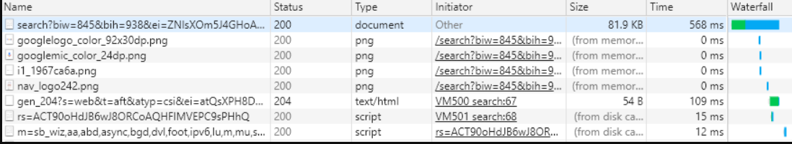

# 缓存机制

## 前言

浏览器缓存是一种简单高效的优化网页的方法。浏览器缓存策略能够缓存文件，
减少网页的网络请求，提高性能，减少带宽消耗。

基本的网络请求就是三个步骤：网络请求，后端处理，浏览器响应。
浏览器缓存能够帮助我们在第一步和第三步中进行性能优化。
比如说：当发送请求时，已经有缓存了，或者说后端的数据与前面一致那么就没必要返回数据，这样就能减少数据响应。

接下来就来分析下浏览器缓存：缓存位置、缓存方式、缓存机制以及应用场景。


## 缓存位置

浏览器会将缓存放在四个位置，并且有优先级。当浏览器四个位置中都没有缓存时，会发生网络请求。

位置顺序如下：

1. Service Worker

2. Memory Cache

3. Disk Cache

4. Push Cache

### Service Worker

Service Woker 是运行在浏览器背后的独立线程，一般可以用来实现缓存。
使用 Service Woker 必须采用 Https，因为 Service Woker 中涉及到请求拦截，所以必须用https来保障安全。
Service Woker的缓存与其他浏览器内置的缓存不同，它可以自由配置缓存哪些文件、如何匹配缓存、如何获取缓存、并且缓存是持续性的。

Service实现缓存一般分为三个步骤：

1. 注册Service Worker

2. 监听install事件

3. 缓存需要文件
```js
    //使用 ServiceWorkerContainer.register()方法首次注册service worker。
    if (navigator.serviceWorker) {
        navigator.serviceWorker.register('./sw.js', {scope: './'})
            .then(function (registration) {
                console.log(registration);
            })
            .catch(function (e) {
                console.error(e);
            });
    } else {
        console.log('该浏览器不支持Service Worker');
    }
```

再来看看具体作为service worker的文件sw.js，例子如下：

```js
const CACHE_VERSION = 'v1'; // 缓存文件的版本
const CACHE_FILES = [ // 需要缓存的文件
	'./test.js',
	'./app.js',
	'https://code.jquery.com/jquery-3.0.0.min.js'
];

self.addEventListener('install', function (event) { // 监听worker的install事件
    event.waitUntil( // 延迟install事件直到缓存初始化完成
        caches.open(CACHE_VERSION)
		.then(function (cache) {
			console.log('缓存打开');
			return cache.addAll(CACHE_FILES);
		})
    );
});

self.addEventListener('activate', function(event) {// 监听worker的activate事件
    event.waitUntil(// 延迟activate事件直到
        caches.keys().then(function(keys) {
            return Promise.all(keys.map(function(key, i){
                if(key !== CACHE_VERSION){
                    return caches.delete(keys[i]); // 清除旧版本缓存
                }
            }))
        })
    )
});

self.addEventListener('fetch', function(event) { // 截取页面的资源请求
    event.respondWith(
        caches.match(event.request).then(function(res) { // 判断缓存是否命中
            if (res) { // 返回缓存中的资源
                return res;
            }
            _request(event); // 执行请求备份操作
        })
    )
});

function _request(event) {
    var url = event.request.clone();
    return fetch(url).then(function(res) {// 使用fetch请求线上资源
        // 错误判断
        if (!res || res.status !== 200 || res.type !== 'basic') {
            return res;
        }

        var response = res.clone(); // 创建了一个响应对象的克隆,储藏在一个单独的变量中

        caches.open(CACHE_VERSION).then(function(cache) {// 缓存从线上获取的资源
            cache.put(event.request, response);
        });
        return res;
    })
}
```
在下次用户访问就可以采用拦截的方式查询是否存在缓存，如果存在缓存则直接使用，否则发起请求。

### Memory Cache
什么是Memory Cache?

Memory Cache是内存中的缓存, 读取速度快，但缓存持续时间短，随着进程的释放而释放。
主要包含当前页面中抓取到的资源，例如页面上已经加载的图片、样式、脚本等。


内存缓存的实际场景：当访问一个页面，再刷新时，会发现很多数据都来自内存缓存。

如下图，看Sise: from memory cache：


内存缓存的实际释放场景：将浏览器标签关闭掉，那么此时内存中的缓存也就释放了。

内存缓存中有一块重要的缓存资源是`prefetch`相关指令下载的资源（<link rel="prefetch">）。
它可以一边下载`css/js`资源一边请求网络请一个资源。

注意：内存缓存并不关心返回的HTTP响应头中的Cache-Control是什么值。
资源也并非仅仅对URL做匹配，还有可能对Context-Type,Cors等其他特征做校验。

### Disk Cache

什么是 Disk Cache ？

Disk Cache 是存储硬盘中的缓存，读取速度较Memory cache慢点，但存储各自资源，并且支持时间长。

在浏览器所有的缓存中，Disk Cahce被使用的最多。它可以根据请求头字段来判断是否能够读取缓存，
判断哪些资源需要重新请求。即使在跨站点访问的时候，相同地址的资源一旦被存储在硬盘中，只要不过期
就不再请求数据了。

浏览器会把哪些文件缓存进内存，哪些存进硬盘：

1. 大文件大概率存在硬盘中，反之存在内存中

2. 使用率高的文件存在硬盘中，反之存在内存中。

### Push Cache

什么是 Push Cache?

Push Cache（推送缓存）是 HTTP/2 中的内容，当以上三种缓存都没有命中时，它才会被使用。它只在会话（Session）中存在，一旦会话结束就被释放，并且缓存时间也很短暂，在Chrome浏览器中只有5分钟左右，同时它也并非严格执行HTTP头中的缓存指令。

Push Cache 在国内能够查到的资料很少，也是因为 HTTP/2 在国内不够普及。这里推荐阅读Jake Archibald的 HTTP/2 push is tougher than I thought 这篇文章，文章中的几个结论：

1. 所有的资源都能被推送，并且能够被缓存,但是 Edge 和 Safari 浏览器支持相对比较差

2. 可以推送 no-cache 和 no-store 的资源

3. 一旦连接被关闭，Push Cache 就被释放

4. 多个页面可以使用同一个HTTP/2的连接，也就可以使用同一个Push Cache。这主要还是依赖浏览器的实现而定，出于对性能的考虑，有的浏览器会对相同域名但不同的tab标签使用同一个HTTP连接。

5. Push Cache 中的缓存只能被使用一次

6. 浏览器可以拒绝接受已经存在的资源推送

7. 你可以给其他域名推送资源

8. 如果以上四种缓存都没有命中的话，那么只能发起请求来获取资源了。

通常浏览器缓存策略分为两种：强缓存和协商缓存，并且缓存策略都是通过设置 HTTP Header 来实现的。