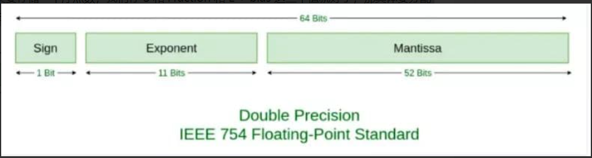

# 数据类型
   JS标准规定了**8种**数据类型，其中有7种简单数据类型：`Undefind` `Null` `Boolean` `Number` 
   `String` `Symbol` `BigInt`。
   以及1种复杂数据类型：`Object`

   ## Undefined 类型
   Undefined 类型只有一个值，即特殊的 undefined。未初始化的变量会自动被赋予undefined值，但是显示地初始化变量依然是明智的选择。
   ## Null 类型
   Null 类型只有一个值，null。从逻辑角度来看，null值表示一个**空对象指针**，而这也正是typeof操作符检测null值时返回“object”的原因。

   如果定义的变量准备在**将来用于保存对象**，那么最好将该变量初始化为null而不是其他值。
   这样一来，只要直接检查null值就可以知道相应的变量是否已经保存了一个对象的应用，如下面的例子
   ```js
    if (car !== null) {

    }
   ```
   实际上，undefined值是派生自null值的，因此ECMA-262规定它们的相等性测试要返回true;
   ```js
    alert(null == undefined); // true
   ```
   ## Boolean 类型
   Boolean 类型时JS中使用最多的一种类型，该类型只有两个字面量：true和false。
   ## String类型
   **1. 字符串** 

   String 数据类型包含一些特殊的字符字面量，也叫转移序列，用于表达非打印字符，或者具有其他用途的字符
   
   **2. 字符串的特点**

   JS中的字符串是**不可变的**，也就说，字符串一旦创建，它们的值就不能改变。要改变某个变量保存的字符串，首先要摧毁原来的字符串，
   然后再用另一个包含新值的字符串填充该变量，例如：
   ```js
     var lang = 'java';
     lang = lang + "Script";
   ```
   ## Number类型

   JS中Number类型使用`IEEE754`标准来表示整数和浮点数值。
   `IEEE754`：**全称IEEE二进制浮点数算术标准**，定义了表示浮点数的格式等内容。

   所谓**浮点数值**，就是该数值中必须包含**一个小数点**，并且**小数点后至少有一位数字**。
   浮点数值的**最高精度是17位小数**。

   在 IEEE754 中，规定了四种表示浮点数值的方式：单精确度（32位）、双精确度（64位）、
   延伸单精确度、延伸双精确度。JS采用的就是**双精确度**，也就是说，会用**64位字节**来存储
   一个浮点数。
  
   ### 深入浮点数精确度

   **前言**

   研究一下 0.1 + 0.2 是否等于 0.3

   **浮点数转二进制**
   
   0.1 用二进制表示就是 0.00011001100110011……

   **浮点数的存储**

   浮点数的储存是根据 ***IEEE754规定*** 的方式来存储的，这个标准方式有一个**公式**来表示浮点数（Value）：

   ```
    Value = sign * exponent  * fraction
   ```

   简单理解就是**科学计数法**

   比如 -1020，用科学计数法表示就是:

   ```-1 * 10^3 * 1.02 ```
   
   ``-1`` 就是 sign， ``10^3`` 就是 exponent， ``1.02`` 就是 fraction

   二进制也是一样，以 0.1 的二进制 0.00011001100110011…… 这个数来说

   ``` 1 * 2^-4 * 1.1001100110011…… ```

   其中 sign 就是 1，exponent 就是 2^-4，fraction 就是 1.1001100110011……

   而当只做二进制科学计数法的表示时，这个 Value 的表示可以再具体一点变成：

   ```
    V = (-1)^S * (1 + Fraction) * 2^E: 
   ``` 

  **(-1)^S** 表示**符号位**，当 S = 0，V 为正数；当 S = 1，V 为负数。

  **(1 + Fraction)**：因为所有的浮点数都可以表示为 **1.xxxx * 2^xxx** 的形式，所以1.xxxx 前面的一定是 1.xxx，就不存储这个 1 了，直接存后面的 xxxxx ，这也就是 Fraction 的部分。

  **2^E**: E **既可能是负数，又可能是正数**，该怎么储存这个 E 呢？我们并不会直接存储 E，而是会存储 **E + bias**。所以，存储一个浮点数，会存 S 和 Fraction 和 E + bias 这三个值，那具体要分配多少个字节位来存储这些数呢？IEEE754 给出了标准：

  

  在这个标准下：

  用 1 位存储 S，0 表示正数，1 表示负数。

  用 11 位存储 E + bias，对于 11 位来说，bias 的值是 2^(11-1) - 1，也就是 1023。

  用 52 位存储 Fraction。

  拿 0.1 来看，对应二进制科学计数法是 1 * 1.1001100110011…… * 2^-4，Sign 是 0，E + bias 是 -4 + 1023 = 1019，1019 用二进制表示是 1111111011，Fraction 是 1001100110011……

  对应 64 个字节位的完整表示就是：

  ```0 01111111011 1001100110011001100110011001100110011001100110011010```

  同理, 0.2 表示的完整表示是：

  ```0 01111111100 1001100110011001100110011001100110011001100110011010```
  
  综上所述，浮点数在被存储的时候就已经丢失精度。

  **浮点数的运算**

  浮点数的运算分为五个步骤：**对阶、尾数运算、规格化、舍入处理、溢出判断**

  看一下0.1 + 0.2 的运算：

  ***对阶*** ：把**价码**调整为**相同**，调整原则是小阶对大阶（即小的阶数调成大的阶数）。
  
  比如：0.1的二进制科学计数法为 ``1.1001100110011…… * 2^-4``，0.2的二进制科学计数法为 ``1.10011001100110...* 2^-3``，0.1的**价码**就是 ``-4``，0.2的**价码**就是 ``-3``；再进行调整，把0.1的``-4``调整为``-3``即 ``0.11001100110011…… * 2^-3``。

  ***尾数运算***：
  ```
    0.1100110011001100110011001100110011001100110011001101 * 2^-3
  + 1.1001100110011001100110011001100110011001100110011010 * 2^-3
  ————————————————————————————————————————————————————————————————
   10.0110011001100110011001100110011001100110011001100111 * 2^-3
  ```
  结果为 ```10.0110011001100110011001100110011001100110011001100111 * 2^-3```

  ***规格化***： 
  
  规格化结果为 ```1.0011001100110011001100110011001100110011001100110011(1) * 2^-2```

  括号里的 1 意思是计算后这个 1 超出了范围要被舍弃。

  ***舍入处理***

  四舍五入对应到二进制中，就是 0 舍 1 入，因为我们要把括号里的 1 丢了，所以这里会进一，结果变成

  ```1.0011001100110011001100110011001100110011001100110100 * 2^-2```

  ***结果*** 
  
  0.1 + 0.3 存成 64 位就是

  ```0 01111111101 0011001100110011001100110011001100110011001100110100```

  将它转换为10进制数就得到 
  
  ```0.30000000000000004440892098500626```

  综上所述，因为0.1和0.2存储时的精度丢失再加上运算时的精度丢失，最终导致了 0.1 + 0.2 !== 0.3

   ## 类型检测

   ### 检测基本类型
   检测变量的基本类型使用`typeof`,除了`null`都可以显示正确的类型。
   
   使用`typeof`检查`null`值会返回`object`。因为从逻辑角度看，`null`表示一个空对象指针。 

   `typeof`检测函数时，会返回“function。

   ### 检测引用类型
   检测变量的引用类型使用: `instanceof`。

   检测某个对象是否为数组使用: `Array.isArray(obj)`
   
   ## 类型转换

   ### 原始值转布尔
   只有 6 种值可以被转换成 false，
   
   不传任何参数时返回 false, 
   
   其他都会被转换成 true，
   ```js 
    console.log(Boolean(undefined)) // false
    console.log(Boolean(null)) // false
    console.log(Boolean(+0)) // false
    console.log(Boolean(-0)) // false
    console.log(Boolean(NaN)) // false
    console.log(Boolean("")) // false
   ```