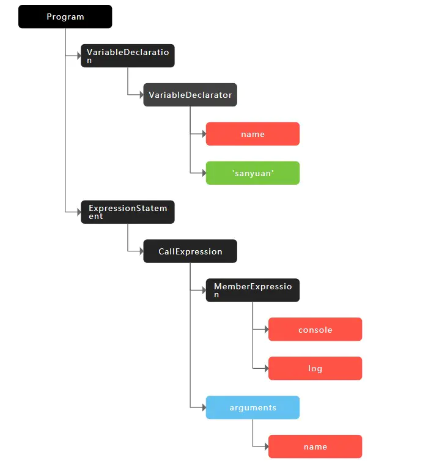

# 执行机制
  
  本节讲述V8的执行机制，来理解JavaScript的执行机制。这是能够帮助我们理解很多上层应用，包括Babel、ESlint、前端框架的底层机制.

  一段JavaScript代码放在V8中是如何的执行？机器是读不懂JavaScript代码的，只能理解特定的机器码。
  如果要让JavaScript代码在机器上运行，就必须将JavaScript代码编译成机器码。由于JavaScript属于解释型语言，解释器会对原代码做如下分析：

  1. 通过词法分析和语法分析生成 AST(抽象语法树)

  2. 生成字节码

  然后解释器根据字节码来执行程序。但 JS 整个执行的过程其实会比这个更加复杂，接下来就来一一地拆解。

  ## 生成AST

  生成 AST 分为两步：词法分析和语法分析。

  词法分析即分词，它的工作就是将一行行的代码分解成一个个token。 比如下面一行代码:

  ```js
  const name = 'wzx'
  ```
  其中会把句子分解成四个部分:

  关键字：`const` 、 变量名：`name`、赋值：`=` 、 字符串：`'wzx'`;

  即解析成了四个token，这就是词法分析的作用。

  接下来语法分析阶段，将生成的这些 token 数据，根据一定的语法规则转化为AST。举个例子:

  ```js
    let name = 'sanyuan'
    console.log(name)
  ```
  最后生成的 AST 是这样的:

  

  当生成了 AST 之后，编译器/解释器后续的工作都要依靠 AST 而不是源代码。生成 AST 后，接下来会生成执行上下文。

  ## 生成字节码

  生成AST后，通过V8解释器(Ignition)来生成字节码。但`字节码`并不能直接让机器运行，还需要转成机器码。
  V8早期直接把 AST 转换成机器码，但是造成严重的内存占用问题。

  **字节码概念**
  字节码是介于AST与机器码之间的一种代码，但与特定类型的机器码无关，字节码需要通过解释器将其转成机器码。

  ## 执行代码

  在代码执行阶段，V8会将重复出现的代码标记为`热点代码`，编译成机器码保存起来，这个用来编译的工具就是V8的编译器。
  在这样的机制下，代码执行效率得到提高。这种编译机制叫作`即时编译`，也就是我们常听到的`JIT`。

  总结一下：

  1. 首先通过词法分析和语法生成`AST`

  2. 接着将 `AST` 转成 字节码

  3. 由解释器逐行执行字节码，遇到重复代码启动编译器进行编译成对应的机器码并保持。